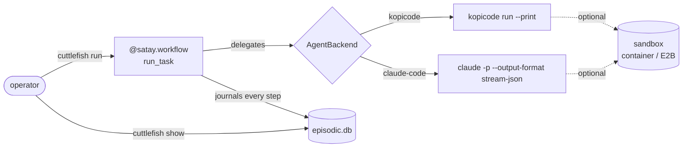

# cuttlefish-crew

A fleet manager for teams of coding sub-agents, running across many software
projects at once, so the operator stops babysitting a single agent's context
window and its own demos by hand.

Give a project's team a task in plain language. Each agent hands its coding
work to a pluggable backend — [kopicode](https://github.com/leejianrong/kopicode)
or headless Claude Code — rather than attempting the edit itself, and if the
process dies partway through, restarting it resumes from where it left off
instead of starting over: the core loop is a durable
[satay](https://github.com/leejianrong/satay-runtime) workflow, not an
ordinary function wrapped in durability later. Everything that happens is
written to one readable record, not scattered across logs that disagree
with each other.

> **Status**: pivoting from a single-task supervisor (V1/V2, complete) into
> the fleet-manager direction above (slice A, the pluggable backend, is
> complete too). See [`CLAUDE.md`](CLAUDE.md) for exactly what's shipped and
> [`docs/PLAN.md`](docs/PLAN.md) for where this is headed.

## How it works



A killed process resumes exactly where it left off — nothing above the
journal is re-run, nothing below it is lost.

## Quick start

```bash
uv sync
uv run cuttlefish run "add a .gitignore entry for build artifacts"
uv run cuttlefish show <task-id>   # printed by `run`, above
```

`run` needs the configured backend's binary on `PATH` — `kopicode` by
default — checked before anything else (a missing one is a config error,
not a mid-task failure), plus a real model credential for that backend.
`CUTTLEFISH_LLM_PROVIDER=replay` swaps in a keyless, deterministic provider
for smoke-testing the CLI itself with no live credential.

## Usage

Declare which shell commands a delegation may run (default: none — only
edits inside `--root` are implicit):

```bash
uv run cuttlefish run "run the test suite" --allow "go test" --allow "npm test"
```

Run the same task against Claude Code instead of kopicode:

```bash
CUTTLEFISH_AGENT_BACKEND=claude-code uv run cuttlefish run "add a .gitignore entry"
```

Route the delegation through a container sandbox rather than the bare host:

```bash
CUTTLEFISH_SANDBOX=container uv run cuttlefish run "add a .gitignore entry"
```

Give one project its own, encrypted-at-rest secret and let a delegation read it:

```bash
export CUTTLEFISH_SECRETS_KEY=$(uv run cuttlefish secrets generate-key)
echo "hf_..." | uv run cuttlefish secrets set --project demo HUGGINGFACE_TOKEN
uv run cuttlefish run "..." --project demo --secret HUGGINGFACE_TOKEN
```

## Configuration

| Variable | Default | What it does |
|---|---|---|
| `CUTTLEFISH_AGENT_BACKEND` | `kopicode` | Which coding-agent backend a delegation runs through: `kopicode` or `claude-code`. |
| `CUTTLEFISH_KOPICODE_BIN` | `kopicode` | Path to the kopicode binary, when that backend is selected. |
| `CUTTLEFISH_CLAUDE_CODE_BIN` | `claude` | Path to the Claude Code binary, when that backend is selected. |
| `CUTTLEFISH_LLM_PROVIDER` | `openrouter` | cuttlefish's own reasoning calls (handover summaries): `openrouter`, `claude`, or `replay` (keyless, for smoke tests). |
| `CUTTLEFISH_SANDBOX` | `none` | Real containment for the delegation: `none`, `container` (local Docker, no account needed), or `e2b`. |
| `CUTTLEFISH_SECRETS_KEY` | unset | Enables `cuttlefish.secrets.SecretsStore` (`cuttlefish secrets ...`, `run --project/--secret`). Unset means no project-scoped secrets store at all. |

A real run also needs a model credential for whichever LLM provider and
agent backend are selected (e.g. `OPENROUTER_API_KEY`, `ANTHROPIC_API_KEY`).

## Contributing

This repo is built by an AI coding agent under human supervision, one
PR-per-slice at a time. [`CLAUDE.md`](CLAUDE.md) is the actual contributor
guide — workflow conventions, toolchain commands, and the boundaries that
follow from this project's architectural decisions
([`docs/adr/`](docs/adr/)).

## The rest of the suite

- [kopicode](https://github.com/leejianrong/kopicode) — the reference coding
  specialist this project delegates to.
- [satay-runtime](https://github.com/leejianrong/satay-runtime) — the durable
  runtime this project's core loop is built on; its own roadmap now follows
  cuttlefish-crew's needs.
- [sibei-flow](https://github.com/leejianrong/sibei-flow) — auto-heals broken
  data pipelines; the sibling project whose hand-rolled transcript is the
  lesson this project's episodic journal is built to avoid repeating.
- [tingkat](https://github.com/leejianrong/tingkat) — a multi-LoRA routing
  benchmark, part of the same suite.

## Licence

Apache-2.0, matching every other repository in this suite. See [LICENSE](LICENSE).
